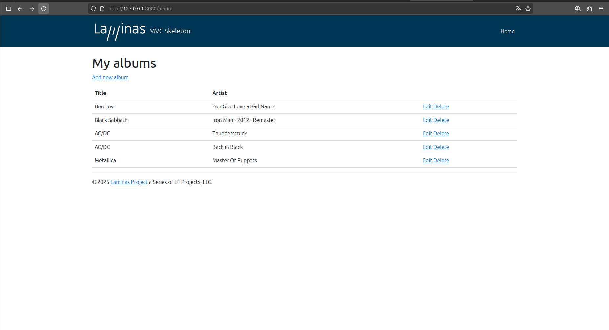

## Introduction

## Installation using Composer

The easiest way to create a new Laminas MVC project is to use
[Composer](https://getcomposer.org/). If you don't have it already installed,
then please install as per the [documentation](https://getcomposer.org/doc/00-intro.md).


Clone o repositório e siga os comandos usando PHP's built-in web server:

```bash
$ cd laminasMVC
$ php -S 0.0.0.0:8080 -t public
```
<!--
# OR use the composer alias:
$ composer serve
-->

This will start the cli-server on port 8080, and bind it to all network interfaces.
You can then visit the site at http://localhost:8080/ which will bring up Laminas MVC Skeleton welcome page.

**Note:** The built-in CLI server is *for development only*.

## Using docker-compose

This skeleton provides a `docker-compose.yml` for use with [docker-compose](https://docs.docker.com/compose/);
it uses the provided `Dockerfile` to build a docker image for the `laminas` container created with `docker-compose`.

Build and start the image and container using:

```bash
$ docker-compose up -d --build
```

At this point, you can visit 'http://127.0.0.1:8080/album' to see the site running.

You can also run commands such as `composer` in the container.
The container environment is named "laminas" so you will pass that value to `docker-compose run`:

```bash
$ docker-compose run laminas composer install
```

## Home Page

